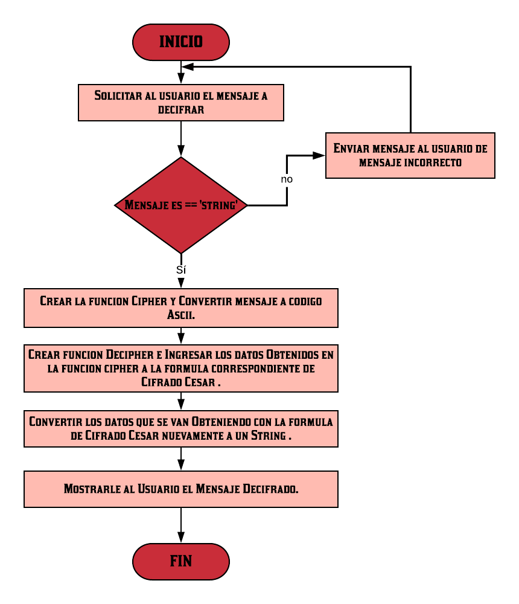

# CIFRADO CESAR
## Instrucciones:
Crea una web que pida, por medio de un prompt(), una frase al usuario y devuelva el mismo mensaje encriptado según el algoritmo de Cifrado César con el parámetro de desplazamiento de 33 espacios hacia la derecha.
### Ejemplo:
```javascript
Texto original: ABCDEFGHIJKLMNOPQRSTUVWXYZ
```

```javascript
Texto codificado: HIJKLMNOPQRSTUVWXYZABCDEFG
```
### Consideraciones:
* El programa debe ser capaz de cifrar y descifrar tanto letras mayúsculas como minúsculas. La fórmula para descifrar es: (x - n) % 26.
* El código debe estar compuesto por 2 funciones con los siguientes nombres: cipher y decipher.
* El usuario no debe poder ingresar un campo vacío o que contenga números.

## Pseudocodigo:
```javascript
1. Solicitarle al usuario que Ingrese el mensaje que quiera decifrar.
2. Validar que el programa no permita que se ingresen números ni espacios en blanco, y en caso de que esto suceda volver a pedirle al usuario que ingrese el mensaje que quiere decifrar.
3. Crear una funcion llamada cipher en la que se convierta el mensaje ingresado por el usuario a un lenguaje que la computadora entienda(ASCII).
4. Crear una funcion llamada decipher en la que a los valores obtenidos en la funcion cipher se le aplique la formula para el cifrado cesar.
5. Convertir el mensaje decifrado obtenido con la formula de cifrado cesar a su lenguaje original(String).
6. Mostrarle al usuario el mensaje decifrado.

```
## Diagrama de Flujo:

